# Hey, I'm Prakash Kumar 👋

**Software Engineer · AI · DevOps**

_Building scalable infrastructure, intelligent systems, and impactful products._

  

---

## About Me

- 💼 **Software Engineer** — open to full-time opportunities
- 🤖 Building AI agents and SaaS platforms.
- 🔭 Currently working on **TickZen** (AI-powered SaaS with ZentriXA voice agent) and **MedTrackFit** (healthcare SaaS)
- 🎓 B.Tech CSE @ DGI, Noida — **CGPA 7.2** (2022–2026)
- 📫 Reach me at **prakashkr2894@gmail.com**

---

## Tech Stack

## Languages

    

## Frontend

   

## Backend & Databases

     

## Cloud & DevOps

     

## AI / ML

   

## Tools & Platforms

         

---

## 📊 GitHub Analytics

---

## 🚀 Featured Projects

### TickZen — AI Powered Task Management SaaS

> Voice-to-action AI task manager powered by **ZentriXA**, an AI assistant that converts speech into executable actions.

<table>
<tr>
<td width="60%" valign="top">

|                 |                                                                                |
| --------------- | ------------------------------------------------------------------------------ |
| **Stack**       | Python (FastAPI) · Node.js (Express) · React · MongoDB                         |
| **Roles**       | Developer · Admin 
| **Integrations**| OpenAI (GPT-4o-mini) · AssemblyAI · Razorpay · Brevo                           |
| **CI/CD**       | GitHub Actions & Docker (docker.yml) pipeline to VPS via PM2                    |

&nbsp;&nbsp;

</td>
<td width="40%" valign="top" align="center">

</td>
</tr>
</table>

---

### MedTrackFit — Health Recovery Platform

> Healthcare SaaS connecting patients, mentors, recovered users, and doctors in one ecosystem.

<table>
<tr>
<td width="60%" valign="top">

|                 |                                                                              |
| --------------- | ---------------------------------------------------------------------------- |
| **Stack**       | Spring Boot · MySQL · OAuth2 · Spring Security · Docker                       |
| **Architecture**| REST API (15+ endpoints) · JWT Authentication                                |
| **Deployment**  | Deployed on Railway via GitHub Actions CI/CD                                 |
| **Roles**       | Patient · Mentor · Doctor ecosystem                                          |

&nbsp;&nbsp;

</td>
<td width="40%" valign="top" align="center">

</td>
</tr>
</table>

---

### VARTALAP — Communication Platform

> Modern communication and collaboration platform built for real-time interaction.

<table>
<tr>
<td width="60%" valign="top">

|             |                                                  |
| ----------- | ------------------------------------------------ |
| **Stack**   | MongoDB · Express.js · React.js · Node.js (MERN) |
| **Feature** | Real-time chat app (via WebSockets/Socket.io)    |
| **Hosting** | VPS (via PM2)                                    |
| **CI/CD**   | GitHub Actions automated deployment to internet  |

&nbsp;&nbsp;

</td>
<td width="40%" valign="top" align="center">

</td>
</tr>
</table>

---

### Aura Elysian — AI-Powered Luxury Fashion Platform

> A premium AI-driven fashion discovery and styling platform delivering personalized luxury experiences powered by intelligent recommendations.

<table>
<tr>
<td width="60%" valign="top">

|                |                                                 |
| -------------- | ----------------------------------------------- |
| **Stack**      | React · FastAPI · MongoDB · OpenRouter · Docker |
| **AI Feature** | Personalized outfit recommendations & style AI  |
| **Design**     | Luxury glassmorphism UI with premium aesthetics |
| **Hosting**      | VPS                                             |

&nbsp;&nbsp;

</td>
<td width="40%" valign="top" align="center">

</td>
</tr>
</table>

---

## 💼 Experience

<table>
<tr>
<td width="50%" valign="top">

### IBM SkillsNetwork (PBEL)
**Virtual Intern** _(July 2025 – Aug 2025)_

- Completed an IBM-certified virtual internship covering backend API design, RESTful service architecture, and mobile integration patterns.
- Gained hands-on exposure to industry-standard development workflows and enterprise-level backend architecture principles aligned with scalable Java-based systems.

</td>
<td width="50%" valign="top">

### Agrasar Soft Consultancy
**Software Developer Intern** _(Nov 2024 – May 2025)_

- Built responsive, reusable UI components in React.js for a full-stack ERP platform used by coaching institutes, integrating REST APIs to display and manage student, staff, and admin data in real time.
- Implemented role-based UI views and protected routes for 3 user roles (Admin, Staff, Student), improving navigation clarity and cutting onboarding time by ~40% vs. the prior manual workflow.
- Collaborated with the backend team on JWT-based authentication and session handling, while using Git for version control and Jira for sprint planning and task tracking within a 4-member team.

</td>
</tr>
</table>

---

## 🏆 Certifications

   
 
   

---

## 🕹️ Contribution Graph

> \_AI isn't waiting for anyone. Build with it, challenge it, or adapt to it.

<picture>
  <source media="(prefers-color-scheme: dark)"  srcset="pacman-contribution-dark.svg">
  <source media="(prefers-color-scheme: light)" srcset="pacman-contribution-light.svg">
  
</picture>

---

_"Building scalable software, intelligent systems, and impactful products."_

